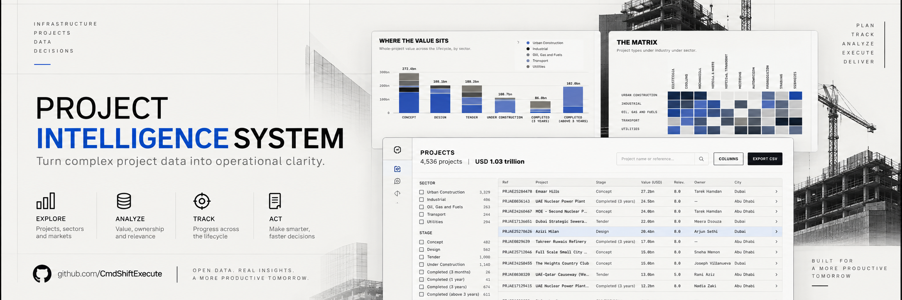

# Project Intelligence System

*A scored market register for a construction sales desk: what is being built, who inside the business already owns the relationship, and how far it has gone.*

## In one glance

- **What it answers**: of everything currently being built, which projects are worth chasing, who inside the business already owns the relationship, and how far it has gone.
- **What is synthetic or masked**: the market register is real and licensed; every reference in it is replaced by a seeded fictional id, and the scores, ownership and activity built on top of it are synthetic.
- **How it is built**: a seeded generator writes every published JSON file from the imported register plus a set of published rules, and 4,189 reconciliation assertions re-read the written files independently on every build.

## What it is

A sales desk cannot chase everything in a market at once, so this dashboard answers one question first: of everything currently being built, which projects actually matter to us, who already owns that relationship, and how far has it gone. Every construction project in the register carries a score per business vertical, and an ownership cascade assigns each qualifying project to exactly one salesperson so books fill evenly rather than by whoever asks first.

The one design rule the whole app turns on: relevance measures fit, ownership assigns a relationship, and neither one is an order. A high score means a project is worth chasing, not that it has been won, and every page keeps that distinction visible rather than collapsing pipeline value into a single misleading number.

## Live demo

**[project-intelligence-system-dashboard.vercel.app](https://project-intelligence-system-dashboard.vercel.app/)**

## Highlights

- **4,536 unique projects** in the register, deduplicated from 4,568 raw source rows across three category imports, with the 32 overlaps resolved by source recency.
- **4,189 reconciliation assertions across 15 categories** (`bun run reconcile`), all currently passing, published live on the Data basis page.
- **194 interaction, keyboard and resilience checks** (`bun scripts/interactions.ts`) drive a real served build with Playwright, and every positive check carries a negative control that must fail before the positive is trusted.
- **A five-step ownership cascade** assigns each project to one vertical and one engineer, publishes its own tie-break record on every project, and explains itself from that record rather than restating the rule.
- **24 engineers, multi-vertical scoring, an 80-row relevance matrix**, and a workload model that scores books by activity rather than by raw count, so owning many quiet projects is not read as being busy.
- **Byte-stable by construction**: a seeded pseudo-random generator (`bun run stable`) hashes every published file, regenerates from the same seed, hashes again, and fails on any difference.
- **Every reference masked**: real market-register identifiers never enter the published tree, replaced by a seeded fictional id (`bun run refs:check` refuses any real reference in the tree before every commit and push).
- **Full URL state on the register**: filters, sort, taxonomy, ownership, relevance floor and activity year all live in the address bar, so any view is a shareable link.

## Pages

| Page | What it shows | Guide |
|---|---|---|
| Overview | Register size, owned value, the top-twenty chase shortlist, management attention, value by sector and stage, and the full activity funnel | [01-Overview](docs/01-Overview.md) |
| Relevance matrix | Every sector, industry and project type against every vertical, as a heatmap that click-throughs to a filtered register | [02-Relevance-Matrix](docs/02-Relevance-Matrix.md) |
| Projects | The full register: filter rail, removable chips, sortable columns, a column chooser and CSV export, all state in the URL | [03-Projects](docs/03-Projects.md) |
| Engineers | Six desk-wide cards, an over-capacity list, and one ruled block per engineer with owned count, pipeline value and activity | [04-Engineers](docs/04-Engineers.md) |
| Engineer book | One engineer's full detail: workload against capacity, activity funnel, project table, and their consultants and contractors | [05-Engineer-Book](docs/05-Engineer-Book.md) |
| Parties | Consultants and contractors ranked by value or count, filterable to firms with no relationship yet | [06-Parties](docs/06-Parties.md) |
| Project detail | One project's figures, its per-vertical scores, its four party slots, and the ownership decision explained from its own record | [07-Project-Detail](docs/07-Project-Detail.md) |
| Data basis | Source provenance, the synthetic/real boundary, definitions, and the live reconciliation table | [08-Data-Basis](docs/08-Data-Basis.md) |

## The data behind it

A seeded pseudo-random generator (`scripts/generate_demo_data.ts`, seed `20260913`) writes every published file from the imported market register plus a set of published rules in `data/rules.ts`, `data/channels.ts` and `data/taxonomy.ts`. The same seed always writes the same bytes: `bun run stable` proves it by hashing, regenerating, and hashing again.

Precision is a stated policy, not a convention: project values are stored in USD millions to one decimal and every rollup is a sum of those same values, relevance scores and percentages carry one decimal, and counts and ratings are whole numbers. Fourteen declared source-shape ranges in `data/shape.ts` state the magnitudes the register is meant to resemble; the generator measures all fourteen before writing and refuses to write a single file if one is missed, and the reconciliation re-measures them from the written files and publishes measured against declared.

See [docs/data-model.md](docs/data-model.md) for the full schema and [docs/08-Data-Basis.md](docs/08-Data-Basis.md) for the source and synthetic boundary.

## Use it with your own data

The generator entry point is `scripts/generate_demo_data.ts` (seed `20260913`): it reads the imported register plus the published rules in `data/rules.ts`, `data/channels.ts` and `data/taxonomy.ts`, and writes every file under `public/data`. Every page reads only that published JSON, never the generator or the source workbooks directly, so pointing the generator at a different register and re-running `bun run data` is enough to retarget the whole app.

The JSON contract lives in `public/data` (see [docs/data-model.md](docs/data-model.md) for the full schema). `src/lib/validate.ts` checks every row of every published file at the app boundary, `bun run reconcile` (`scripts/reconcile.ts`) independently re-reads the written files and re-derives every figure the pages show, and `bun run stable` (`scripts/check_stable.ts`) proves the generator is deterministic by hashing, regenerating from the seed, and hashing again.

## Quality gates

- `bun run reconcile` re-reads the written JSON independently of the generator's own in-memory checks and publishes **4,189 assertions across 15 categories** (shards and register, precision policy, relevance matrix, ownership cascade, descriptions, engineers, verticals, headline figures, sector by stage, activity funnel, worth chasing, consultants and contractors, matrix summary, party summary, source shape). Five deliberate corruptions are its negative controls.
- `src/lib/validate.ts` checks the published data at the boundary before the register cache is populated, every row of every file, not a sample.
- `bun run stable` hashes every published file, regenerates from the seed, hashes again, and fails on any file that changed, appeared or disappeared.
- `bun run typecheck` runs the TypeScript compiler in strict mode with no emitted output.
- `bun run lint` runs oxlint across the source.
- `bun run contrast` reads the color tokens directly from `src/styles/index.css`, so it cannot drift from the stylesheet, and fails below a 4.5:1 text floor or a 3:1 non-text floor.
- `bun scripts/interactions.ts` drives a real served build with Playwright: structure at three viewport widths, the filter rail against the page's own predicate, sorting, the matrix heatmap and its click-through, keyboard traversal, and resilience against a missing shard, a malformed rollup and an unknown route. **194 checks**, each positive paired with a negative control.
- `bun run refs:check` refuses a commit or push if any real market-register reference has leaked into the published tree.
- `scripts/scan_staged.sh` refuses a commit, commit message or push carrying a credential shape or an em or en dash, wired into git by `scripts/install_hooks.sh`.
- `bun run check` chains the full sequence: reference check, data generation, reconciliation, byte-stability, typecheck, lint, motion check, build, contrast, reference check again.

## Design system

A print-style Swiss industrial look shared with its sibling demos: a display face (Archivo Black) for headings and a monospace face (JetBrains Mono) for figures and labels, set against a paper background with ink and a second print ink for non-text marks. Every chart carries entry motion, a keyboard-parity pointer readout, and, where a second reading of the same data helps, a view switch that remembers its state per chart. Hazard red is earned and marks only closed projects. The interaction gate was rebuilt with a phone pass: every route checked at a narrow viewport in mobile Chromium, with a negative-control check for the WebKit bug that reports an SVG element's first scroll-into-view once and never again, which is why a chart can pass every desktop check and still draw nothing on a real phone.

See [docs/design-system.md](docs/design-system.md).

## Run it locally

1. `bun install` installs dependencies.
2. `bun run data` imports the private source workbooks and writes the public JSON tables (the raw source and the reference map stay under gitignored `.private/` and are never published).
3. `bun run check` runs the full gate chain: reference check, data, reconcile, byte-stability, typecheck, lint, motion, build and contrast.
4. `bun run dev` starts the Vite dev server.

## Sibling demos

Two other demos share the same print-style Swiss industrial design system and the same masthead:

- **[Management Information System](https://github.com/CmdShiftExecute/management-information-system)**, a management information system covering sales, pipeline, net profit and receivables. [Live demo](https://management-information-system-dashboard.vercel.app/)
- **[Warehouse Management System](https://github.com/CmdShiftExecute/warehouse-management-system)**, a warehouse management system for stock, inbound and replenishment. [Live demo](https://warehouse-management-system-dashboard.vercel.app/)

## Roadmap

- A configurable relevance-matrix weighting so a reader can re-score the whole register against a different set of verticals without editing `data/rules.ts` by hand.
- An exportable per-engineer book (PDF or CSV) matching what `04-Engineers`/`05-Engineer-Book` show on screen, for use outside the dashboard.
- A pluggable import adapter for the register (beyond the single `scripts/import_bnc_data.py` shape), so a different source workbook layout does not need a hand-written parser.

## License

The code is [MIT licensed](LICENSE). Project labels come from a licensed market-intelligence register with every reference masked; every internal score, owner and activity is synthetic; no real company, person or figure is represented. See [DATA-NOTICE.md](DATA-NOTICE.md) for the full data notice.
