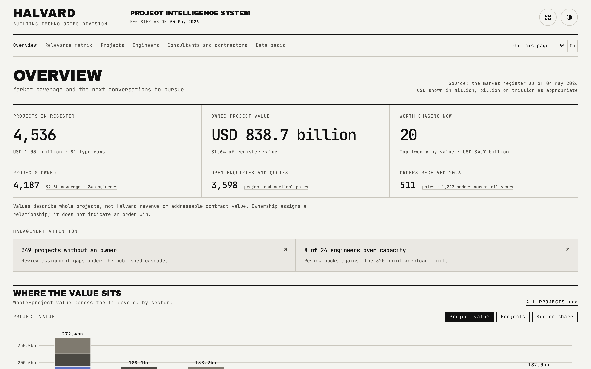
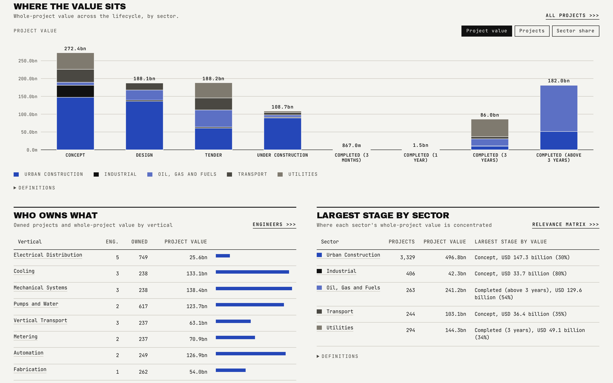

# Overview

The landing page answers three questions in order: how big is the register, how much of it does the desk already own, and which projects are worth chasing right now. Everything below that is supporting detail, not a second headline.

## What is on the page

- **Six headline cards**: register size and value, owned value, the top-twenty chase shortlist, owned count, open enquiry/quote pairs, and current-year order pairs. Full project value is kept explicitly distinct from an owned or addressable figure.
- **Management attention**: the published no-owner population and any engineer above workload capacity, surfaced so a manager sees exceptions without hunting for them.
- **Where the value sits**: a sector-by-stage chart with value, count and share views.
- **Who owns what**: vertical ownership by engineer.
- **Worth chasing now**: the top twenty projects by value that meet the chase rule.
- **The activity funnel**: every project-and-vertical pair, bucketed into one of eleven activity states.

## How the figures are built

- The chase list is every project at Tender, or Under Construction at 5.0 percent complete or less, with overall relevance 5.0 or more, and no vertical already marked Project closed. The top twenty by value publish here.
- Overall relevance is the highest of a project's ten vertical scores, so a project that matters to one vertical is never read as low priority overall.
- The no-owner figure and the over-capacity engineers come straight from the ownership cascade and the workload model documented in [data-model.md](data-model.md).
- Every number on this page is reconciled independently by `bun run reconcile` under the "Headline figures", "Sector by stage", "Worth chasing" and "Activity funnel" categories.

## Interactions

The sector-by-stage chart and the activity funnel both carry a view switch that re-reads the same underlying data under a different measure, with keyboard parity and a pointer readout. Every card and chart drills into a Projects view whose population matches the figure shown, filtered through the URL rather than a separate query.

## See also

- [Relevance matrix](02-Relevance-Matrix.md) for how a project earns its scores.
- [Projects](03-Projects.md) for the full register behind every drill.
- [Data basis](08-Data-Basis.md) for the reconciliation table this page's numbers come from.
- Back to [README](../README.md).
