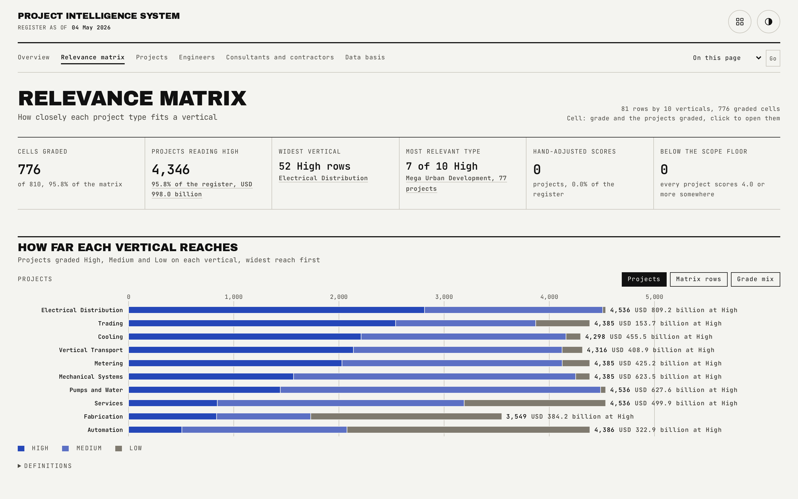
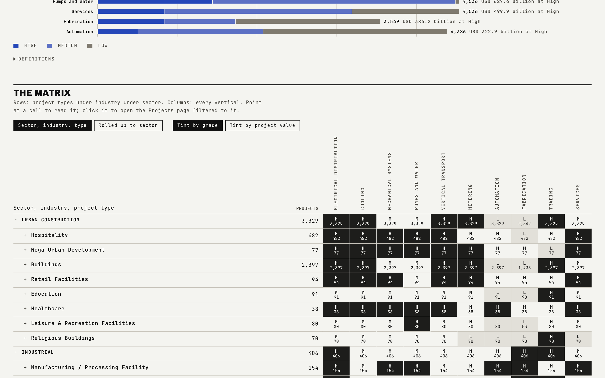

# Relevance Matrix

The register's only opinion about what matters lives in one table: every sector, industry and project type on one side, every business vertical across the top, and a grade in every cell. Everything else in the app follows from this matrix.

## What is on the page

- **The heatmap**: rows for sector, industry and project type, columns for every vertical, shaded by grade.
- **How far each vertical reaches**: a summary of how much of the register each vertical is eligible for.
- **The grade scale**: how High, Medium and Low convert to numbers.
- **How a project gets its scores**: the plain-English walk-through of the scoring rule.

## How the figures are built

- A grade converts to a number: High is 8.0, Medium is 5.0, Low is 2.0, no relevance is null.
- Every project's type maps deterministically to one row of the matrix, and that row's grades become the project's own scores.
- This commercial relevance layer is illustrative and kept distinct from the source project fields it sits beside.

## Interactions

Clicking a matrix cell opens the Projects page pre-filtered to that combination. The matrix supports a rolled-up sector-level view alongside the full detail level. The interaction gate predicts the value tint of a fresh cell directly from the data and checks it against the rendered swatch, with the retired flat-tint rule kept as a negative control.

## See also

- [Overview](01-Overview.md) for how scores roll up into the chase shortlist.
- [Projects](03-Projects.md) for the filtered register a matrix click opens.
- [Data basis](08-Data-Basis.md) for the reconciliation categories covering the matrix.
- Back to [README](../README.md).
