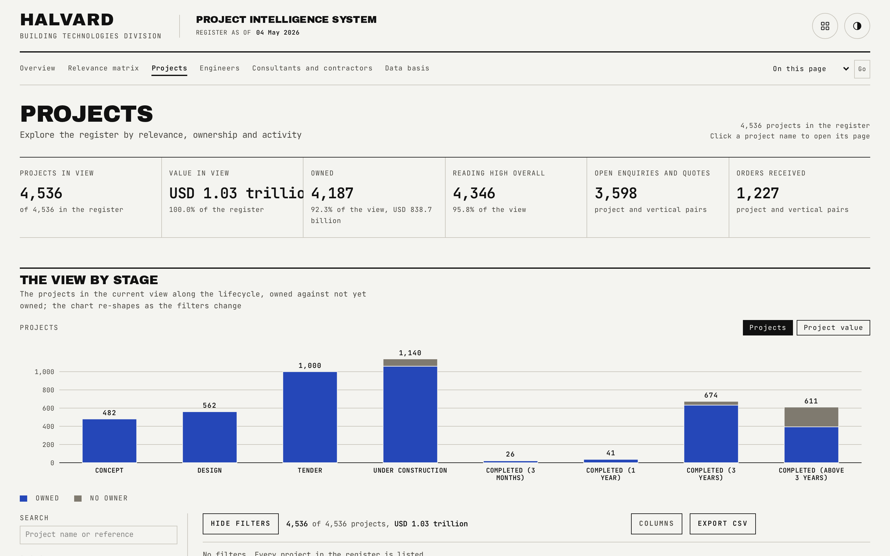
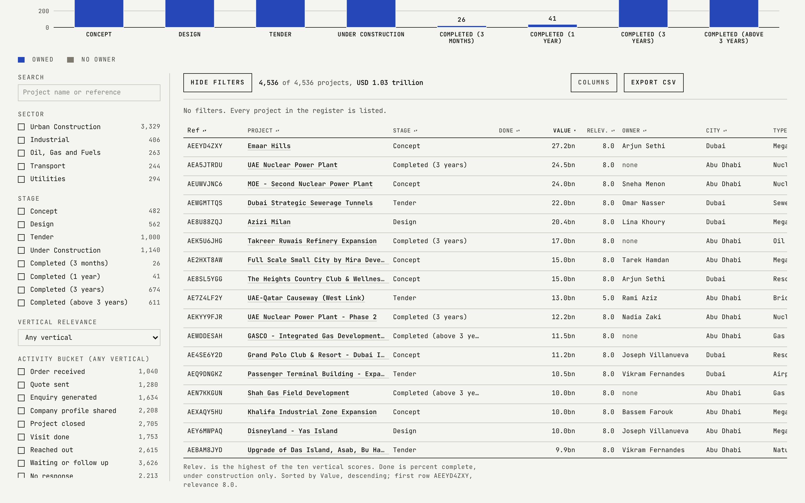

# Projects

The full 4,536-project register, with every filter, sort and column choice held in the URL so any view is a link that can be shared or bookmarked.

## What is on the page

- **A filter rail** with removable chips for taxonomy, stage, city, value and activity.
- **An always-visible count and value** for the current filtered view.
- **A sortable, virtualised table** with a column chooser and CSV export.

## How the figures are built

- `owned` filters to 1 for owned projects, 0 for unowned.
- `omin` is a floor on overall relevance; 6.5 is the point at which a project reads as High.
- `year` restricts activity pairs dated in that calendar year; combined with `bucket`, the pair must sit in both the named bucket and the year.
- `nocon` filters to projects with no lead and no MEP consultant recorded; `nokon` to projects with no main and no MEP contractor appointed.
- `ov` filters to one vertical by its slug.

## Interactions

Every filter is a URL parameter, so the browser back button and shared links both restore the exact view. The interaction gate predicts the filtered count and value from the published JSON using the same predicate the page itself uses (`src/lib/filters.ts`), then checks the rendered table against that prediction, at three viewport widths including a phone width with a full keyboard walk.

## See also

- [Relevance matrix](02-Relevance-Matrix.md) for the scores behind `ov` and `omin`.
- [Project detail](07-Project-Detail.md) for what a single row opens into.
- Back to [README](../README.md).
