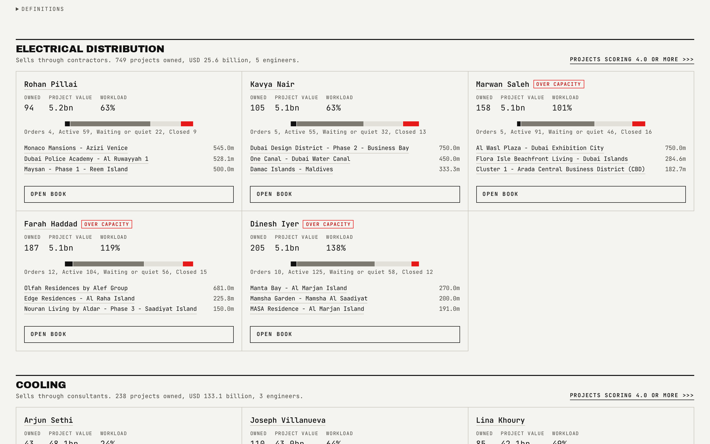

# Engineers

Twenty-four sales engineers, one ledger-style block each, so a manager can see who is carrying what without opening every book individually.

## What is on the page

- **Six desk-wide cards**, including "Over capacity" and "Heaviest load".
- **A full-width chart of every book**, with a workload view that draws the capacity line across it.
- **One block per engineer**, grouped by vertical: owned count, pipeline value, activity funnel, and an over-capacity tag on any book past the line.

## How the figures are built

- Owning many projects is not the same as being busy. Each owned project earns workload points by its activity band: an active pair (quote sent, enquiry generated, profile shared, visit done, reached out) is worth 3 points, an order received or a quiet pair 1, a closed project 0.
- Engineer capacity is 320 points, set so a handful of the 24 books exceed it. `loadPct` is the workload against capacity, and `overloaded` is true above the line.
- Both the weights and the capacity are synthetic and are published on the Data basis page rather than hidden inside the code.
- The ownership cascade that fills each book is the same one described in [data-model.md](data-model.md): scope floor, stage gate, highest score, engineer pick by lowest current pipeline value.

## Interactions

The books chart carries a view switch between value and workload, with the capacity marker drawn across the workload view. The interaction gate checks that the books chart reads a value the published data predicts, and that the workload card, its view and the capacity marker all agree.

## See also

- [Engineer book](05-Engineer-Book.md) for one engineer's full detail page.
- [Overview](01-Overview.md) for the desk-wide no-owner and over-capacity figures.
- Back to [README](../README.md).
