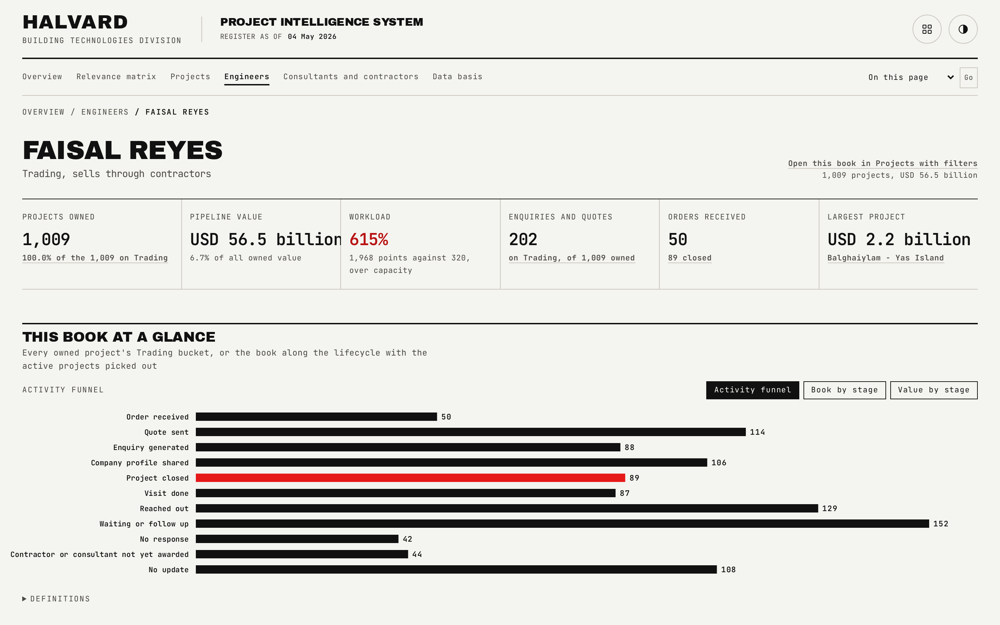

# Engineer Book

One engineer's own page: everything they own, how full their book is, and who they hold the relationship with.

## What is on the page

- **Six cards**: projects owned, pipeline value, workload as a percent of capacity, enquiries and quotes, orders received, largest project.
- **A full-width chart with a view switch** across the activity funnel, the book by stage, and value by stage.
- **The full project table** for that engineer.
- **The consultants and contractors** they hold a relationship with.

## How the figures are built

- The engineer pick step of the ownership cascade assigns each qualifying project to the engineer with the lowest current pipeline value at the moment of the decision, so books fill evenly rather than by whoever asks first.
- Workload is the same points model used on the desk-wide Engineers page: active pairs worth 3, orders or quiet pairs worth 1, closed projects worth 0, against a 320-point capacity.

## Interactions

The activity-funnel, book-by-stage and value-by-stage chart shares one view switch, keyboard-navigable, with a pointer readout that carries keyboard parity. The project table and party lists filter to this engineer only.

## See also

- [Engineers](04-Engineers.md) for the desk-wide view this page drills from.
- [Parties](06-Parties.md) for the firms an engineer's book connects to.
- Back to [README](../README.md).
