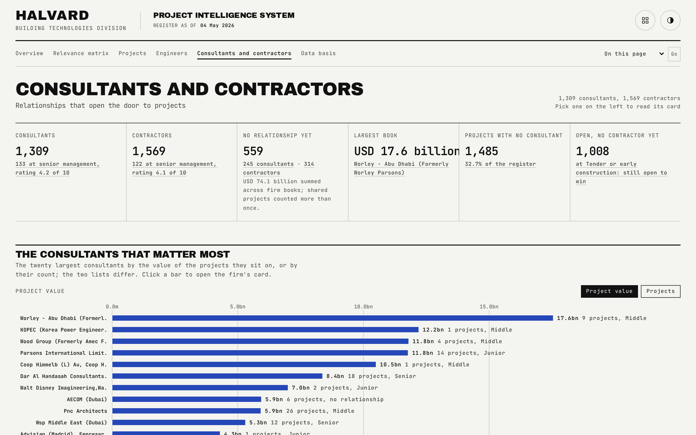

# Parties

The "who is the door in" page: every consultant and contractor in the register, ranked, filterable, and honest about where no relationship exists yet.

## What is on the page

- **Six cards**, including "No relationship yet".
- **The twenty largest firms** of the current ranking, charted.
- **A picker** that ranks firms by value or by count, on the whole book or on one vertical, and filters by relationship state.
- **A firm's card**: relationship level, rating and owning engineer, or a "None yet" strip, the projects it sits on, every vertical it is in play on with the count behind each, and the other firms it shares projects with.

## How the figures are built

- Party project membership comes from the source workbook company cells, so which firms sit on which projects is real. The relationship level, rating and owning engineer are illustrative, because those fields are absent from the source.
- A firm's chance of having no relationship is drawn from its book size: 60 percent for a firm with no owned project, 20 percent for a firm on three projects or fewer, 5 percent for four to eight, and a larger book always has one. Level, rating and owner are then all null together.
- `Not Yet Awarded` and `See Sub-Projects` are treated as missing company appointments, not as firms.

## Interactions

The ranking picker supports value or count, whole-book or single-vertical (`v`), and a relationship filter (`rel`, held or none), all in the URL. The interaction gate checks the top-twenty firms ranked by count as well as by value, and the per-vertical ranking reachable in two clicks.

## See also

- [Engineer book](05-Engineer-Book.md) for the firms one engineer personally holds.
- [Data basis](08-Data-Basis.md) for the no-relationship cohort rule in full.
- Back to [README](../README.md).
