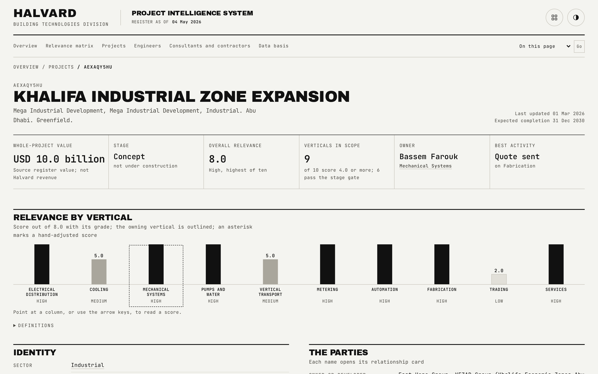

# Project Detail

One project's full record, at `/p/:ref`, including the exact reasoning behind who owns it.

## What is on the page

- **Six figures**: value, stage, overall relevance, verticals in scope, owner, best activity.
- **The ten vertical scores** at the section's full width directly beneath the headline figures.
- **Identity and the four party slots**: lead consultant, MEP consultant, main contractor, MEP contractor.
- **The owner and the cascade step that decided it**, with a tie explained from its own record when one occurred.
- **The activity bucket per vertical.**
- **A generated description**, built from the project's own consultant and contractor slots.

## How the figures are built

- Every ownership decision is published on the project record as `why`: the eligible verticals, the gate that fired, the candidates that passed it, and, when two or more candidates shared the top score, the tied verticals, how many projects each already carried at the moment of the decision, and which half of the tie rule actually decided it, "fewer" or "order". The page renders its explanation from that record rather than restating the rule, so it can never say a vertical had fewer projects assigned when the two counts were actually equal.
- The description builds its consultant clause and its contractor clause independently: a lead consultant is named when there is one, an MEP consultant when there is one, and the "no consultant recorded" sentence is used only when both slots are empty. Contractors follow the same rule.
- Reference ids on this page are masked: a two-letter country code followed by seven characters (for example `AE22C8L5B`), drawn from a seeded map. The real source reference never enters the published tree, and `bun run refs:check` refuses a build if one does.

## Interactions

The party slots link to their firm's card on the Parties page. The description clauses are checked against the party fields beside them by the interaction gate, so the sentence can never claim a consultant the record does not carry.

## See also

- [Projects](03-Projects.md) for the register this page drills from.
- [Parties](06-Parties.md) for the firms named on this page.
- [Data basis](08-Data-Basis.md) for the ownership cascade rule in full.
- Back to [README](../README.md).
