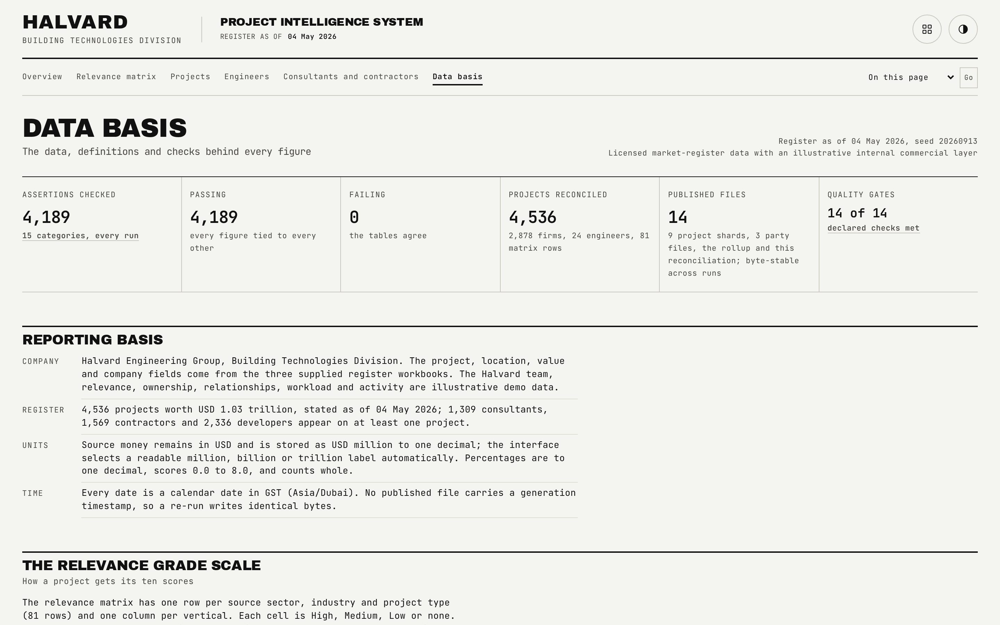

# Data Basis

Source provenance, the real/synthetic boundary, definitions, and the machine's own reconciliation, published where anyone reading the app can check it.

## What is on the page

- **Source provenance**: where the project and company data comes from, and what was excluded.
- **The authentic and illustrative boundary**, stated plainly rather than implied.
- **Quality checks**: the live reconciliation table, 2,783 assertions across 15 categories.
- **Definitions**: the grade scale, the ownership cascade steps, the workload model, the activity buckets.
- **The declared source shape**: fourteen ranges, measured against declared.

## How the figures are built

- Project names, stages, values, locations, sectors, industries, types, and the consultant, contractor and owner labels come from a licensed market-intelligence register. Every project reference is masked behind a seeded fictional id and the real ids never enter the published tree. Contacts, phone numbers, emails and assignees are excluded entirely.
- The 24 sales engineers, every relevance score, owner, activity bucket, workload figure and relationship level are synthetic, generated deterministically from the seed.
- `bun run reconcile` re-reads the written files independently of the generator's own in-memory checks and publishes every assertion here, alongside five deliberate corruptions kept as negative controls: a description that drops the MEP consultant, a tie rule flipped, a half-recorded relationship, a workload off by one with its verdict flipped, and a shape measurement pushed 30 points off. All five currently fail the gate, as they should.
- `src/lib/validate.ts` checks every row of every published file at the data boundary, not a sample: field types, closed vocabularies, the ten-long score and bucket vectors, the tie record's internal consistency, and the whole-or-absent relationship state.

## Interactions

This is the one page in the app with no chart by design: it is the reference page, not an analytical one. The interaction gate uses Data basis as the negative control for the six-cards-and-a-chart pattern every other route carries.

## See also

- [Data model](data-model.md) for the full schema this page summarises.
- [Quality gates](quality-gates.md) for every check that feeds this page.
- Back to [README](../README.md).
